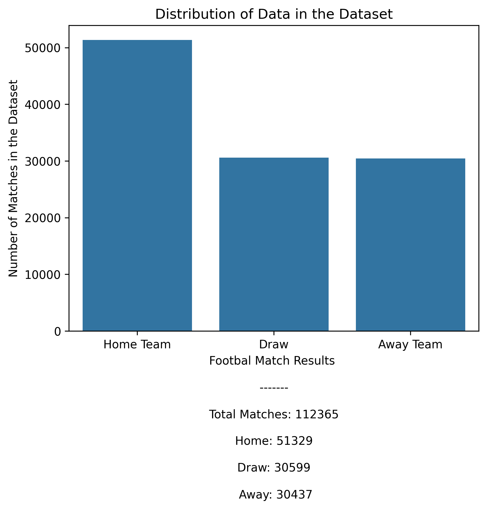
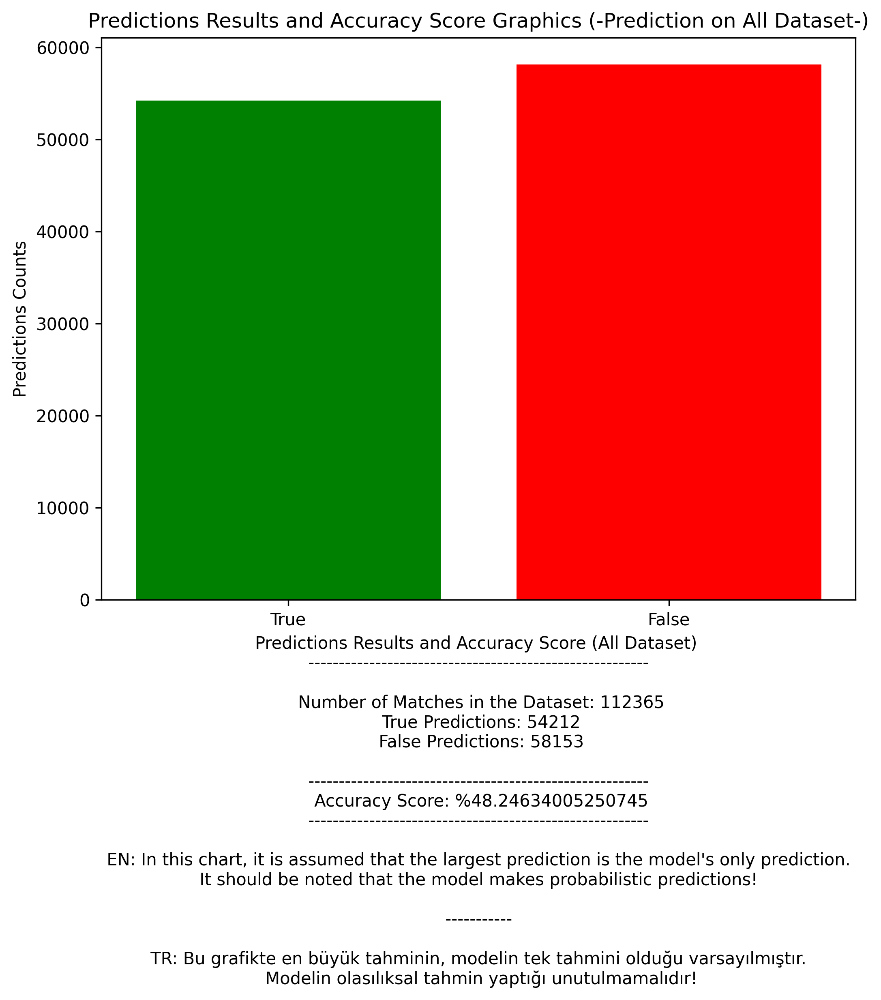
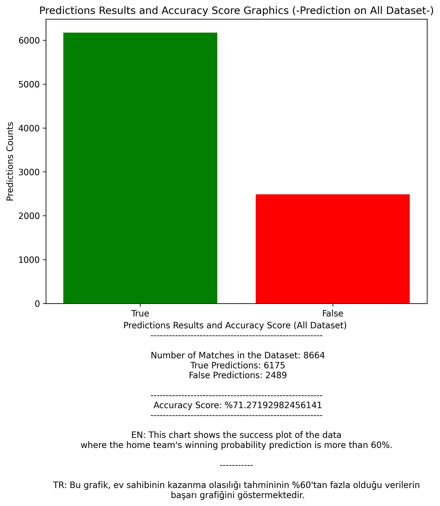
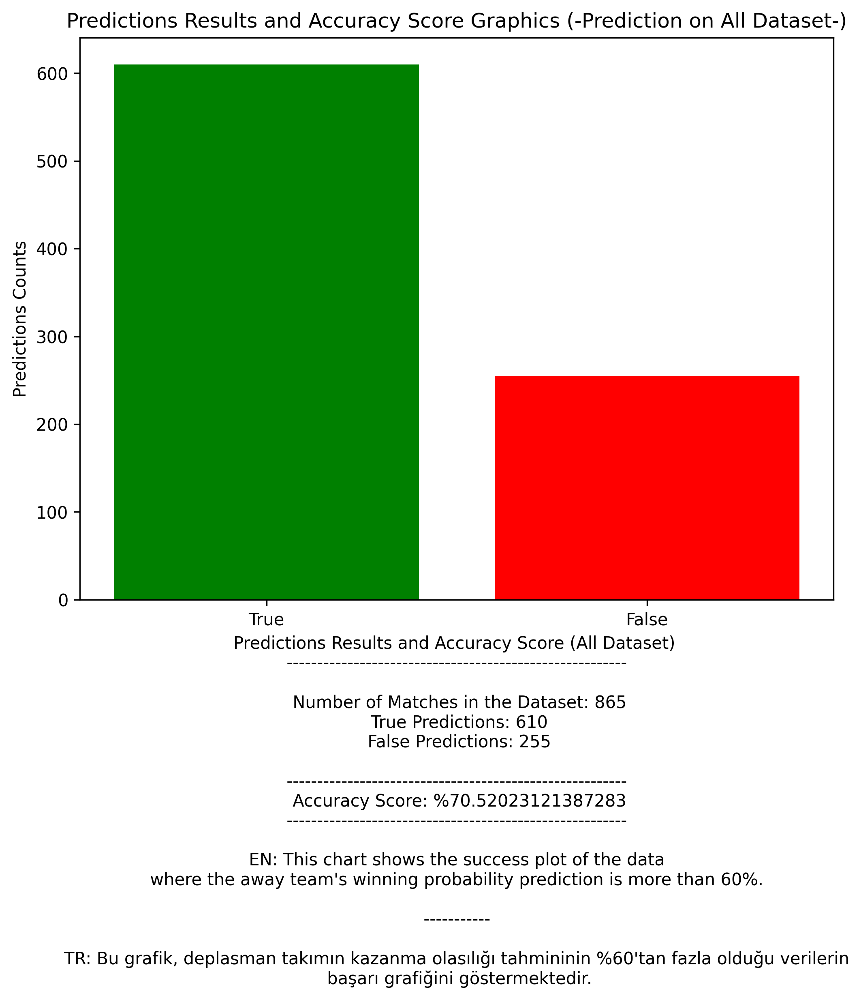
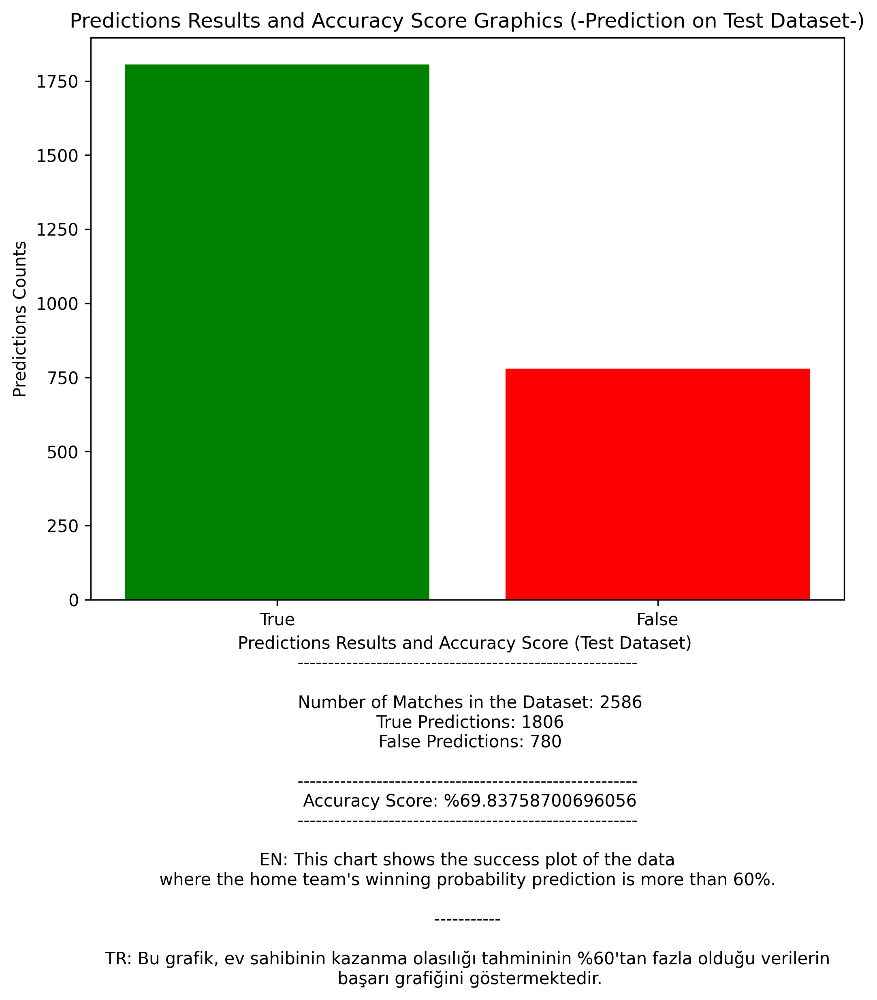
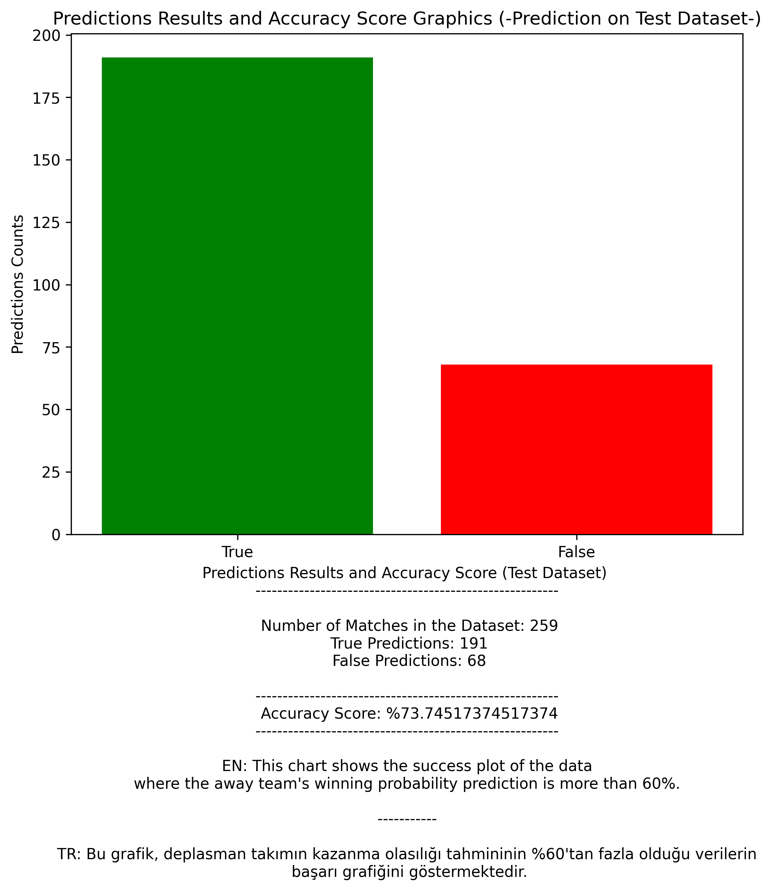

# Oracle Octopus Ai
* In this project, our artificial intelligence models predict the results of football matches and the winning probabilities of the teams. \
Predictions are purely probabilistic predictions and may not reflect the actual result.
* The project can only predict league matches!
* The project was trained by giving data from the 2nd week of the league matches.
* This project was created with Python 3.9.

# Statics and Graphics

# Installation and Usage
## on Colab
* If you are going to use it on Google Colab, upload the 'Oracle_Octopus_Ai_Colab.ipynb' file to [Colab](https://colab.research.google.com).
* Then you can use the project by following the steps in the video.
## on Local
* If you want to run it locally, before download file https://huggingface.co/55utd55/oracle-octopus-ai/blob/main/mssonuc-models.zip
* Run the command below and then you can use it by watching the youtube video.
* Open the Anaconda Prompt
* `conda create -n oracle-octopus-ai python=3.9`
* `pip install tensorflow[and-cuda]`
* `pip install -r requirements.txt`

## English Installation and User Guide - Video
 \
Click the picture and watch the video!

## Türkçe Kurulum ve Kullanım Rehberi - Video
 \
Resime tıkla ve videoyu izle!
